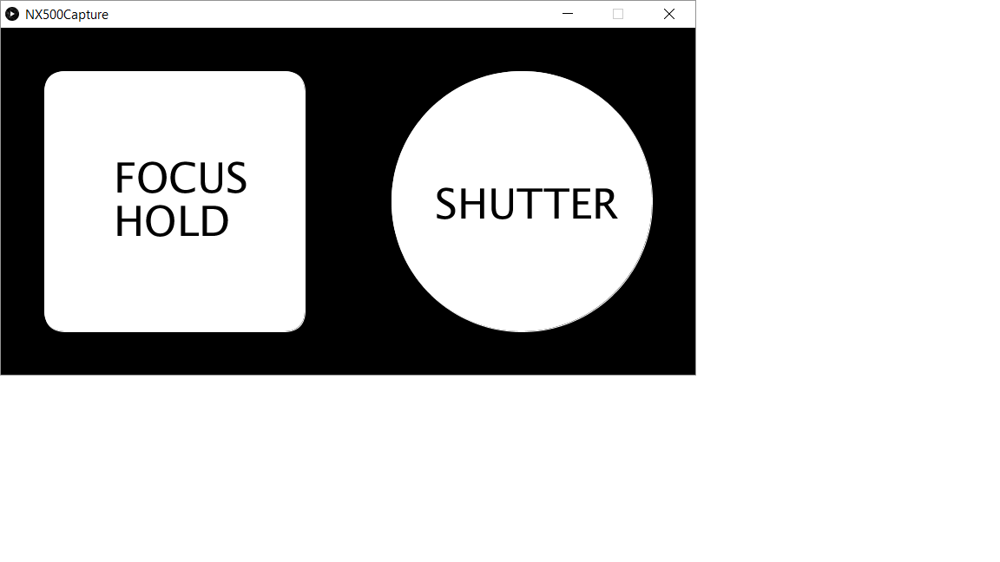

# Wifi Remote Capture Broadcast Message Receiver for Samsung NX500/NX1 Cameras

This repository contains code for running a Wifi Remote Capture Broadcast message receiver in the Samsung NX500/NX1 cameras that have firmware altered with the NX-KS modification (version v2.85 and later). With this code multiple cameras can be triggered to take photos and video simultaneously when connected together over a local area Wifi network. For information about the camera firmware modifications and download needed to use the code here see https://www.facebook.com/NXKS2/ and https://github.com/ottokiksmaler/nx500_nx1_modding

The code consists of two parts, 1) Broadcast message receiver in the NX500 camera and 2) Processing Android Broadcast Message Sender App. The Broadcast receiver on the NX500 runs in the background to respond to message text commands. The Processing Android app sender code found here transmits broadcast messages over a local network to control the NX500 camera focus/shutter control operations. To get the code to work you need the Processing.org SDK and use in Android Mode with the OSCP5 library added for building the app. You also have to turn on "INTERNET" permissons.

I wrote a newer Android app for the Google Play Store that adds video recording operations via simulated key presses. You can install it at https://play.google.com/store/apps/details?id=com.andymodla.remotecapture

Once you have installed the NX-KS mode in your NX500 camera, to set up the remote capture receiver in your cameras, copy the folder "mod" into the base of the SD card used with each of your NX500 cameras. This folder must be present to start the receiver. The "mod" folder in this repository is located in the folder: NX500Capture/nx-remote-capture-daemon/

After you power up your camera, next turn on Wifi for the local network you will be using. Then display the NX-KS menu with a double tap of the +/- button. Select the "Focus + Profiles" menu item and check the "My Checkbox" item. Now exit the menu and the camera is ready to receive broadcast messages for remote capture control. It is not necessary to set "My Checkbox" again. It is necessary to turn on Wifi every time you power on your camera. The broadcast receiver will wait for Wifi in the background before it begins its server.

This is a screen shot of the Processing Android app code running:

The broadcast message text command codes correspond to the following NX500 "st" commands that simulate key press and release operations:

Each code is a single ASCII letter, that may be followed by 4 ASCII digits for the photo number.

F  system("st key push s1") // focus press and hold

Cxxxx  system("st key push s2; st key release s2; st key release s1") // capture: shutter press and release all

Sxxxx  system("st key push s2; st key release s2") // shutter press and release

R  system("st key release s2; st key release s1") // focus and shutter release

Vxxxx  system("st key click rec") // video record start unless recording then stop

V  system("st key click rec") // video record stop unless stopped then record

P  system("st key click ok") // video pause/resume

X  // exit

xxxx is the photo number, example 0021

==========

Notes:

The Processing library OSCP5 reference information used for UDP network broadcast is available at http://www.sojamo.de/libraries/oscp5/reference/index.html
OSCP5 download page http://www.sojamo.de/libraries/oscp5/

https://www.processing.org for the Processing 3+ SDK, Android Mode

Broadcast receiver code based on:

https://github.com/mewlips/nx-remote-controller-mod

https://www.experts-exchange.com/viewCodeSnippet.jsp?codeSnippetId=23948

https://www.experts-exchange.com/questions/23074851/Sending-Broadcast-packets-using-UDP-in-Linux-C.html
